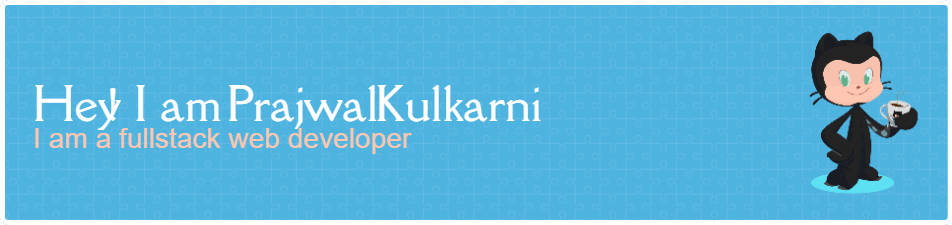

<h1 align="center">Hi 👋, I'm Prajwal Kulkarni</h1>
<h3 align="center">A passionate full stack developer</h3>

  

- 🎓 Final year engineering student passionate interested in web development, data science and AI.

- 🌱 I’m currently learning **React**

- 👨‍💻 All of my projects are available on my [GitHub](https://github.com/prajwalkulkarni-07)

- 📫 How to reach me **mkprajwal07@gmail.com**

---

### 🛠️ Projects & Research

#### 🔬 AI/ML Projects
- **🔍 Automated Blood Cell Detection Through Image Segmentation**  
  Developed a deep learning pipeline to segment and classify blood cells using image processing techniques.
  
- **🧠 Chronic Kidney Disease Prediction using Explainable AI**  
  Built interpretable machine learning models (SHAP, LIME) to predict CKD, aiding early diagnosis.  
  🧑‍🤝‍🧑 Collaborators: Prajwal Kulkarni, Pratapkumar Bhajantri, Harshal Kumar

- **🫁 Multi-Label Classification of Chest X-Rays**  
  Deep learning-based classifier to detect thoracic disorders using CNNs.  
  📄 Paper accepted at 4 prestigious conferences including I4C-2024 (MSRIT) and CSITSS (RVCE).  
  👥 Team: Kartik Patil, Prajwal Kulkarni, Pratap Kumar, Sharon Rose

- **🧬 Cervical Cancer Detection using XceptionNet**  
  Built an ensemble deep learning model hosted on a web interface using React.  
  🖼️ Dataset: 7-class image classification  
  🔬 Currently training and evaluating performance using Google Colab.

#### 🌍 Impact Bridge
- **🌐 NGO-Philanthropist Bridge Portal**  
  A web app aimed at connecting NGOs and donors, targeting **UN SDG Goal 1: No Poverty**.  
  🔗 Features: Donor dashboard, project funding tracker  
  💡 Goal: Help donors and NGOs collaborate on a platform and contribute to change.

#### 🛡️ Hackathons & Competitions
- 🧠 **Hack2Future (IIIT Dharwad)** – Finalist among 400+ teams  
- 🛡️ **Presidency University Hackathon** – National-level participation  
  👥 Team: Hrishikesh Tubachi, Pratapkumar Bhajantri, Kartik Patil

---

### 📱 Connect with me

---

### 🧰 Languages and Tools

  
  
  
  
  
  </a>
  
  
  
  
  
  

---
